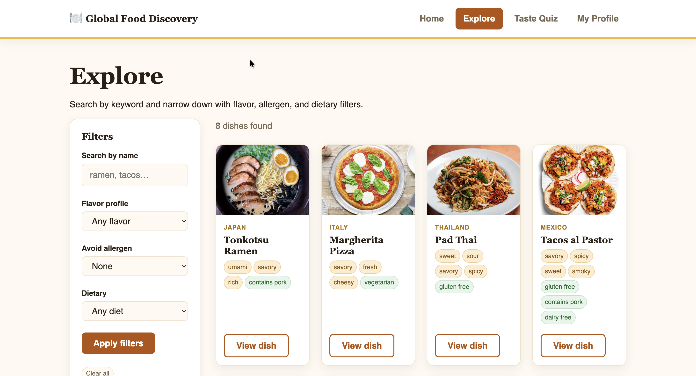
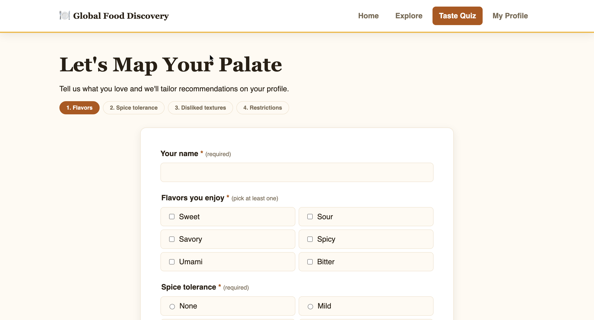
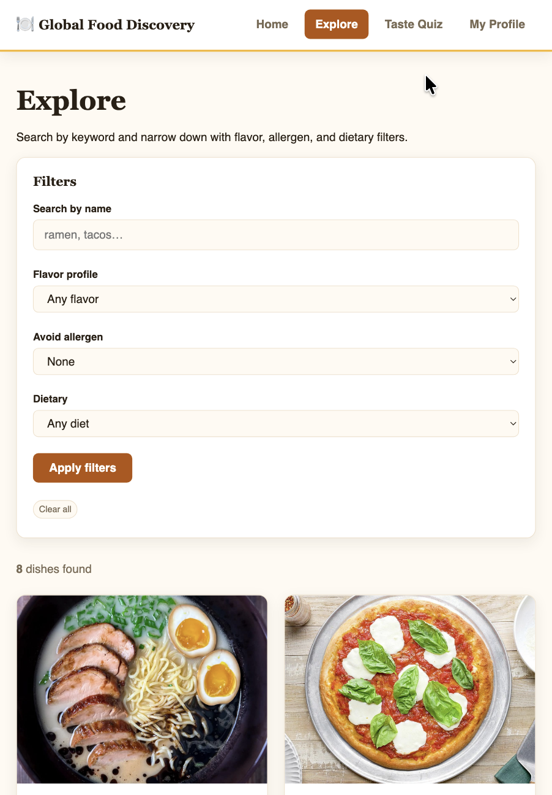
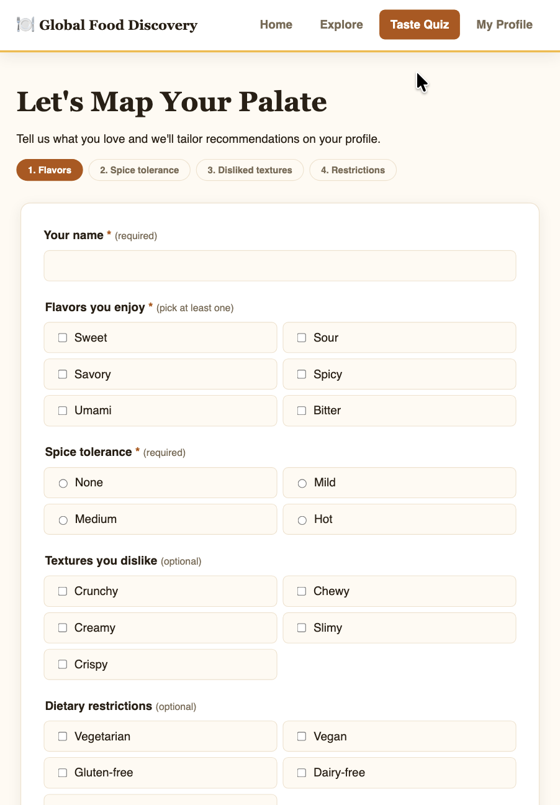
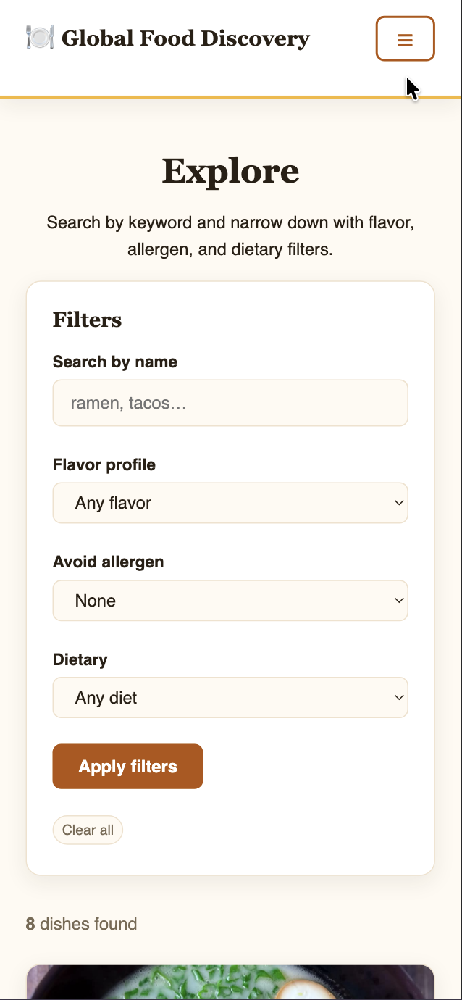
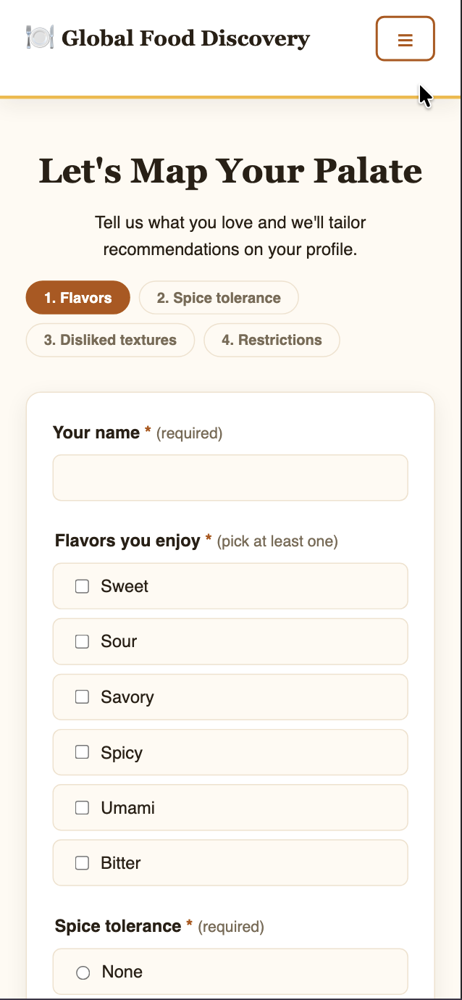

Responsive QA Checklist
Project: Global Food Discovery
Date Tested: July 11, 2026

Desktop (1200px+)

☑ Home page loads correctly
☑ Navigation links work
☑ Search bar functions properly
☑ Featured dishes display correctly
☑ Explore page displays all dishes
☑ Detail page loads the correct dish
☑ Quiz page accepts user input
☑ Profile page displays saved preferences
☑ Images load correctly
☑ Footer displays correctly

Screenshots (Desktop):

Tablet (992px)

☑ Grid adjusts to two columns
☑ Navigation remains accessible
☑ Images resize correctly
☑ Text remains readable
☑ Buttons remain clickable

Screenshots (Tablet):

Mobile (576px)

☑ Layout stacks vertically
☑ Navigation remains usable
☑ Search bar fits screen
☑ Images resize correctly
☑ Text remains readable
☑ Buttons are easy to tap
☑ No horizontal scrolling

Screenshots (Mobile):

Accessibility

☑ Images include descriptive alt text
☑ Heading hierarchy is correct
☑ Forms include labels
☑ Color contrast is readable
☑ Keyboard navigation works

The website functioned correctly across desktop, tablet, and mobile screen sizes. Navigation, forms, search functionality, and responsive layouts performed correctly.